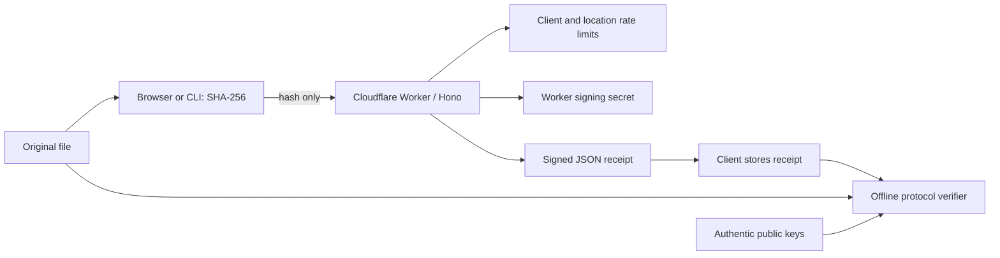

How a Momento timestamp flows through the system, from your file to offline verification:

Next.js exports the website and Fumadocs documentation to static files served by Worker Assets. The Worker handles `/api/*`; static `_headers` rules apply to assets, while API headers are set by middleware. The browser shares receipts in URL fragments, which are not included in HTTP requests.

The protocol package contains receipt parsing, canonical signing bytes, public keys, and verification. The CLI streams original files and installs Git hooks that link commits to their parents’ signed receipts. Proofs live in the repository’s `momento-proofs` branch, synchronized without changing the working tree. The bundled GitHub Action has two modes: `stamp` hashes raw commit object bytes and requests a receipt; `verify-history` checks existing signatures, byte hashes, receipt links and time ordering without requesting new receipts. It publishes coverage and a per-commit report to `momento-badges`. Existing repositories can select an explicit activation boundary. See the [Git integration guide](/docs/git).

There is no receipt database. Structured API logs contain generated request IDs, known route names, method, status, elapsed time, and whether a rate limit was hit. Deployment configuration enables Cloudflare observability. See [operations](/docs/operations) and [trust boundaries](/docs/threat-model).
