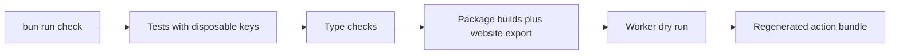

Use Bun 1.3.13+ and Node.js 22.18+. Start with:

```sh
bun install --frozen-lockfile
bun run check
```

`check` runs tests, type checks, builds public packages, exports the website, performs a Worker deployment dry run, and regenerates the bundled GitHub Action. No production signing secret is needed. Tests use disposable keys and a clearly marked public test vector.



For local web development, run `bun run build:packages` and `bun run dev`. The web tools use their own origin by default. Set `NEXT_PUBLIC_API_URL=http://127.0.0.1:8790` in `apps/web/.env.local` and run `bun run dev:api` in another terminal for the local API. To use a local signer, follow the README; never replace the published key or commit a private signing key.

Keep pull requests focused. Describe the behavior changed and the verification performed. Add meaningful regression tests for protocol, signing, parsing, and publishing changes. V1 receipts are intentionally rejected in v2. Preserve uncompromised v2 verification keys under routine rotation. Git integration changes must cover receipt links, activation scope, proof synchronization and the push gate; regenerate `scripts/action.bundle.mjs` with `bun run build:action` after changing Action dependencies or implementation. Signing byte changes require a new protocol version and domain separator.

Report security issues privately as described in [SECURITY.md](/docs/security).

Development uses Bun 1.3.13 (`bun install --frozen-lockfile`, `bun run dev`). The frontend runs with Bun; the API runs in Cloudflare’s Worker runtime through Wrangler. Node.js 22.18+ remains required for the Node compatibility test suite and published CLI; the bundled GitHub Action uses Node 24. npm is retained for npm package publication.
