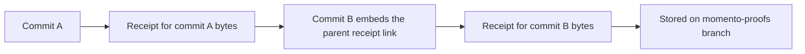

Momento can attest commits as you create them. Local Git hooks link each new commit to its parents' signed receipts, then timestamp the SHA-256 of the exact commit body. Receipts live in your repository's separate `momento-proofs` branch. The Momento signing endpoint receives only hashes; this integration adds no server-side receipt archive.

<Callout type="info" title="Checks first: how you prove history is intact">
- `git verify` — offline check of every commit in scope: signatures, exact commit hashes, all parent receipt links, and non-decreasing receipt times.
- Pre-push gate — the `pre-push` hook blocks the push when local commits are unconfirmed or proofs are missing.
- CI `verify-history` — the [GitHub Action](/docs/github-action) re-runs the same offline check in CI and publishes the coverage badge.
</Callout>



## Install the hooks

Requires Git and Bun 1.3.13+. The compiled CLI also runs under Node.js 22.18+. Until the packages are published, build the CLI in a Momento checkout:

```sh
bun install --frozen-lockfile
bun run build:packages
```

From the repository you want to attest, run the compiled CLI using its absolute path:

```sh
bun /absolute/path/to/momento/packages/cli/dist/index.js git init
```

After package publication, use `momento-timestamp git init`. The installed hooks remember the absolute runtime and CLI paths; reinstall if you move either. Hooks are local and must be installed separately by every contributor. Existing hooks are preserved as `HOOK.momento-original` and run before Momento's hooks; pre-push input is delivered to both. Installation refuses a custom `core.hooksPath` to avoid modifying a shared hook manager's configuration.

Initialization makes one online request. In a new repository it creates a signed start anchor before the first commit. In an existing repository it timestamps the current HEAD as the explicit activation boundary and prints its SHA. Earlier history is not assigned retroactive formation times. It records that boundary in local `momento.startCommit` configuration.

## Commit and push normally

```sh
git commit -m "Add login"
git push origin main
```

The `prepare-commit-msg` hook appends one `Momento-Parent-Receipt: COMMIT sha256:DIGEST` line per parent. A root commit instead contains a `Momento-Anchor-Receipt` line. The digest is SHA-256 of the canonical JSON tuple `[version, hash, issuedAt, receiptId, keyId, signature]`, so cosmetic receipt JSON formatting does not alter the link. The `post-commit` hook requests and verifies the new receipt, stores it under `COMMIT.json`, and updates `refs/heads/momento-proofs` without changing the working tree or index. Existing receipts cannot be overwritten.

The `pre-push` hook checks the actual pushed tips, then publishes `momento-proofs` to the same remote before the normal code push. Proof and source updates are separate pushes: a failed source push can leave extra proofs, which do not count unless their commits are reachable from the verified target. Concurrent contributors can run `momento-timestamp git sync [remote]` before working or after a rejected proof push. It fetches and merges the receipt trees without changing the working tree; signatures are verified and conflicting receipts for the same commit are rejected. Non-fast-forward proof pushes are rejected, never forced. Proof and badge maintenance branches are excluded from commit coverage.

You must have receipts for parents before creating linked children. If signing fails, Git has already created the commit: it remains unconfirmed. Retry from that repository:

```sh
bun /absolute/path/to/momento/packages/cli/dist/index.js git stamp
bun /absolute/path/to/momento/packages/cli/dist/index.js git verify
```

`git stamp [COMMIT]` timestamps existing bytes at the current server time; it does not repair missing parent links or invent an earlier date. Preserve the proof branch in backups. Deleting local receipts can block the next commit or push. A fresh clone must fetch it before working:

```sh
bun /absolute/path/to/momento/packages/cli/dist/index.js git sync origin
```

Then install the hooks. For an existing attested repository, configure the team's original activation SHA before initialization, so the local check uses the same boundary as CI:

```sh
git config momento.startCommit ORIGINAL_ACTIVATION_SHA
```

For a repository attested from its root, initialization detects the complete valid chain and keeps entire-history mode. The root's signed anchor is already in the fetched proofs; new commits use their parent receipts. If local configuration contains an unwanted activation boundary, clear it with `git config --unset momento.startCommit`.

## Check history: verify offline

```sh
bun /absolute/path/to/momento/packages/cli/dist/index.js git verify
bun /absolute/path/to/momento/packages/cli/dist/index.js git verify --start-commit ACTIVATION_SHA
```

Verification requires full Git history, the proof branch and authentic verification keys; it makes no signing request. It checks every reachable commit in scope, including merged side branches, signatures, exact commit hashes, all parent receipt links and non-decreasing receipt times. The activation commit is checked for a valid receipt but has no claimed lower formation bound. Side-branch commits outside the activation commit's ancestry are also checked; a later merge cannot silently import unattested history.

A normal `git commit` and regular non-fast-forward merge are supported, including octopus merges with more than two parents (one `Momento-Parent-Receipt` line per parent from `MERGE_HEAD`). Fast-forward merges reuse existing commits. Amend, rebase, cherry-pick and squash can change parents or create commits through other Git paths; this version does not automatically re-attest their rewritten chains. They can produce unconfirmed commits, which verification and the push gate reject. Bypassing or modifying hooks cannot make an invalid chain pass an independent verifier.

## Check in CI: coverage badge

Use the Action's `verify-history` mode described in [GitHub Action](/docs/github-action). It verifies existing proofs instead of issuing receipts in CI. Green means every commit in the reported scope passes verification. An explicit activation boundary produces a badge marked `since activation`; without one, the entire history must pass, including the root anchor.

The report identifies the checked HEAD and verification time. The badge represents that completed check, not a live guarantee about subsequent remote changes. A negative verification publishes an orange or red badge before failing CI. Checkout, configuration, network or publishing failures can still leave the previous badge visible. Public badges require publicly readable report JSON.

## What the chain establishes

A commit containing an authentic prior receipt can only be formed after that receipt becomes available. Its own receipt provides an upper bound, subject to Momento's clock and signing-key trust. Changing Git's author or committer date does not change these bounds. Neither bound establishes when its source code was written or whether it was human-written.

The signing service is stateless with respect to this chain: it cannot detect deleted or undisclosed alternative histories. There is no independent blockchain consensus or public transparency log. Repository owners can change proofs or workflow policy, so independently verify the report's HEAD, scope, receipts and trusted verifier. Git date fields are covered by the commit hash, but their truth is not certified; use the reported receipt bounds instead. See [Trust and time accuracy](/docs/trust).

## Check another repository

Use the Check repository tab in the [tools](/#tools) or the [Check a repository](/repositories) page to generate installation and verification commands for an HTTPS Git remote. The tool substitutes your URL and optional full activation SHA into copyable commands. Verification runs on your computer using Git and the CLI; no repository-checking API or server archive is involved. Source installation is available now, and registry installation with Bun is labelled for use after package publication.
