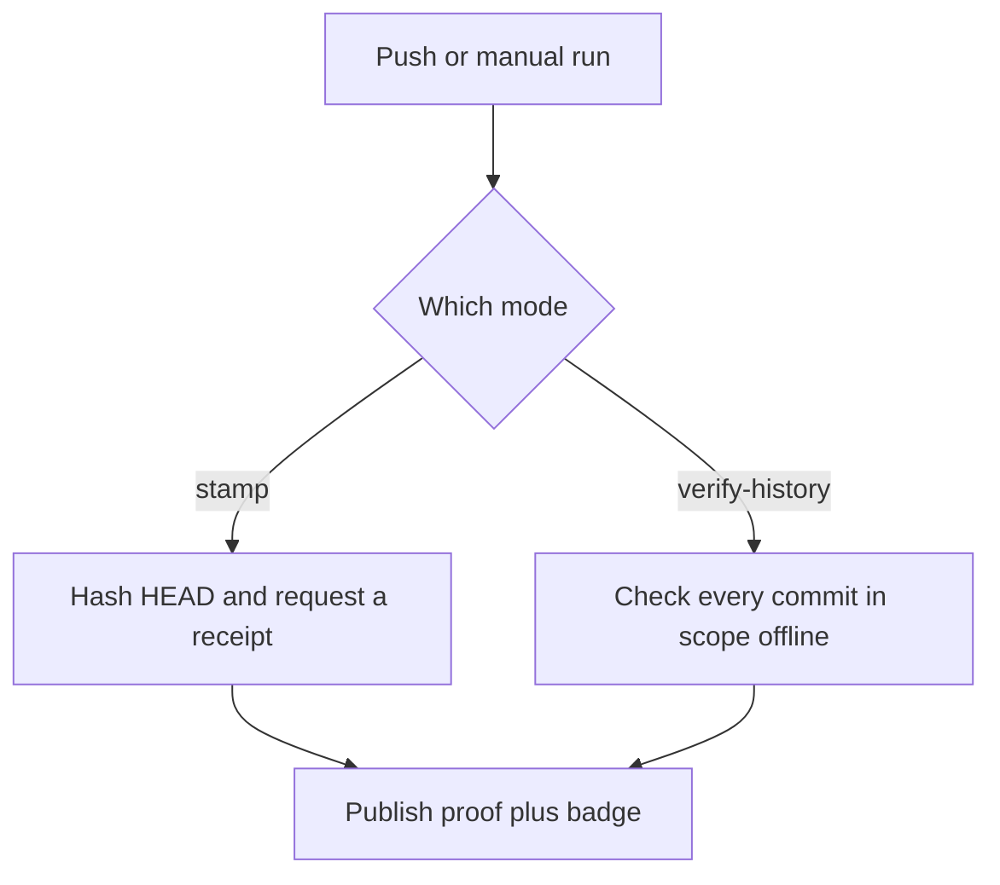

Use `verify-history` with the local Git hooks to publish confirmed commit coverage, or the default `stamp` mode to timestamp your checked-out commit and show **Momento's signed UTC time**. Both modes can publish the Shields.io badge data and proof to your repository's `momento-badges` branch.

<Callout type="info" title="Recommended: check, don't just stamp">
Pair this Action with the [local Git hooks](/docs/git): contributors attest each commit locally, then `verify-history` checks every commit in scope offline — signatures, byte hashes, receipt links, and time ordering — before publishing the badge. Use `stamp` only for repositories without local attestation.
</Callout>



## Check history in CI (verify-history)

Install the [local Git integration](/docs/git) on contributors' computers first. Set `mode: verify-history` to replace CI timestamping with offline verification of existing receipts. This mode never calls Momento to issue receipts or fill gaps.

```yaml
name: Momento history
on:
  push:
    branches: [main]
  workflow_dispatch:
permissions:
  contents: write
concurrency:
  group: momento-history
  cancel-in-progress: false
jobs:
  verify:
    runs-on: ubuntu-latest
    steps:
      - uses: actions/checkout@v7
        with:
          ref: main
          fetch-depth: 0
      - uses: MIKTHATGUY/momento@main # Pin the release containing this mode to a reviewed SHA.
        with:
          mode: verify-history
          start-commit: ${{ vars.MOMENTO_START_COMMIT }}
```

For a repository attested from the root, leave `MOMENTO_START_COMMIT` unset. For existing history, set that repository Actions variable to the full activation SHA printed by `git init`. The published badge explicitly says `since activation`; the verifier never trusts a start boundary selected by untrusted receipt files. Review changes to the variable and workflow policy.

The Action fetches `refs/heads/momento-proofs` from origin and checks every reachable commit in scope, including merged side branches, signed receipt/commit matches, all parent links and receipt time ordering. It does not need a Bun install: the Node 24 entry point includes its verification dependencies. Development changes must regenerate the committed entry point with `bun run build:action`.

The local pre-push hook publishes proofs before the source push, so the source workflow can fetch them. A proof-only push does not contain this workflow and does not automatically rerun it: after repairing receipts for an existing source HEAD, use **Run workflow**. Exclude `momento-badges` from triggers to avoid publication loops.

The README badge URL below stays the same. Its message changes to `128/128 confirmed` or `128/128 confirmed since activation`. Missing receipts produce orange; invalid proofs produce red. The report is `momento-badges/proof.json` and includes HEAD, scope, checked time, per-commit results and formation bounds. The Action publishes a negative result before failing the job. Checkout/configuration/network/publication failures can still leave the previous badge visible, and caches can delay any update. The badge is the last completed check, not an independent signature or a live monitor.

Use `publish-badge: 'false'` to keep the report local; outputs `confirmed`, `total`, `valid`, `scope`, `commit` and `proof-path` remain available. To preserve a failed verification report, give the artifact step `if: always()`.

## 1. Timestamp a single checked-out commit

Add the following workflow as `.github/workflows/momento.yml`, or add its Momento step after checkout in your existing CI/CD job:

```yaml
name: Momento timestamp
on:
  push:
    branches: [main]
  workflow_dispatch:
permissions:
  contents: write
concurrency:
  group: momento-timestamp
  cancel-in-progress: false
jobs:
  timestamp:
    if: github.ref == 'refs/heads/main'
    runs-on: ubuntu-latest
    steps:
      - uses: actions/checkout@v7
      - uses: MIKTHATGUY/momento@main
        id: momento
```

Replace `main` with your branch name if needed. For reproducible use, pin the Action to a reviewed full commit SHA. When adding it to existing CI/CD, keep the `contents: write` permission and concurrency group, run on your chosen source branch, and exclude `momento-badges` from triggers. Place the step after your build/tests if the badge should update only after they pass.

No Momento account, API key, signing secret, bun install, GitHub Pages setup, or custom publishing script is required. The Action uses GitHub's automatic token. Repository or organization rules must allow that token to create and update the dedicated `momento-badges` branch, whose files are managed by the Action. Automatic publishing supports repositories on github.com.

## 2. Add the Shields.io badge to your README

Replace `OWNER` and `REPO` with your public GitHub repository:

```markdown
[](https://github.com/OWNER/REPO/blob/momento-badges/proof.json)
```

The Action also outputs your complete badge Markdown in the workflow run summary and as `steps.momento.outputs.badge-markdown`. The badge becomes available after the first successful run and updates automatically on subsequent successful runs. Badge URLs and endpoint JSON explicitly request a 300-second (five-minute) cache, the current minimum for Shields.io endpoint badges. GitHub raw-content caching and its Camo image proxy can add delay, so this is not a guaranteed refresh deadline. In `stamp` mode, a failed run leaves the last successfully published timestamp visible. In `verify-history` mode, verification failures publish a negative result before failing the job; failures before publication can leave an older badge visible.

The badge displays the verified receipt's `issuedAt`, for example `Momento | 2026-09-25 12:34:56.789 UTC`. This is when Momento issued the receipt during CI, not Git's author or committer date. Clicking the badge opens the proof and signed receipt. The badge itself is a display; verify the receipt before relying on it.

### Badge freshness

Use `&cacheSeconds=300` on the Shields.io URL, as shown above. The [Shields.io endpoint implementation](https://github.com/badges/shields/blob/master/services/endpoint/endpoint.service.js) enforces a minimum of 300 seconds; `cacheSeconds=1` cannot force instant refreshes. `maxAge` is not the documented cache control for this badge type.

A browser hard refresh does not purge GitHub's server-side image cache. If a badge remains stale after the caches expire, follow [GitHub's Camo troubleshooting instructions](https://docs.github.com/en/authentication/keeping-your-account-and-data-secure/about-anonymized-urls). GitHub recommends using a Camo purge sparingly. Changing the README image URL with a one-time `&v=2` gives GitHub a new image URL, but does not guarantee fresh upstream JSON. Automatically rewriting the README on every run would add commits and complicate which commit is being timestamped; the Action keeps a stable badge URL instead.

## Inputs, outputs, and verification

| Input | Default | Purpose |
| --- | --- | --- |
| `mode` | `stamp` | `stamp` issues a receipt for HEAD; `verify-history` checks local-hook proofs |
| `target-ref` | `HEAD` | Target commit/ref for history verification |
| `proofs-ref` | `refs/heads/momento-proofs` | Dedicated proof branch fetched from origin (fixed in this version) |
| `start-commit` | empty | Explicit activation boundary; empty checks the entire history |
| `publish-badge` | `true` | Publish proof and badge to your repository; set to `'false'` for local files only |
| `github-token` | `${{ github.token }}` | Automatic workflow token; publishing needs `contents: write` |
| `output-directory` | `momento-proof` | Local directory containing the generated proof |

### Outputs

In `stamp` mode, outputs are `issued-at`, `commit`, `committed-at`, `hash`, and `proof-path`, plus `badge-url` and `badge-markdown` when publishing succeeds. The Action uses Node 24 and requires Git and a checkout. It timestamps `HEAD`; in a pull request job this may be a synthetic merge commit. `verify-history` requires a full checkout and instead reports `confirmed`, `total`, `valid` and `scope`, along with `commit`, `proof-path` and publishing outputs.

The output directory and published branch contain `badge.json`, `proof.json`, `receipt.json`, and `commit.txt`. The latter contains the exact raw commit object body hashed with SHA-256. Only that hash is sent to Momento. The proof includes Git metadata separately from the signed receipt. The surrounding metadata is not separately signed.

### Verify the commit receipt

To independently verify the receipt, run `bun run build:packages`, then `bun run --cwd packages/cli start -- verify path/to/receipt.json path/to/commit.txt` from a Momento checkout. Compare `commit.txt` with the raw bytes returned by `git cat-file commit COMMIT` in the original repository to verify the commit association.

### Private repositories

For private repositories or jobs without write permission, set `publish-badge: 'false'` and optionally preserve `momento-proof/` with `actions/upload-artifact@v7`. A public Shields.io badge requires publicly readable JSON; it cannot read a private repository's branch. See the [Shields.io endpoint specification](https://shields.io/badges/endpoint-badge) for customization.
