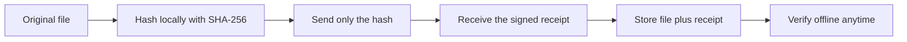

Momento reads its server clock and signs your file’s SHA-256 hash with ML-DSA-65. No account or API key is required. The original file never leaves your device.



## Use the tools

[Open the tools](/#tools) to create, verify, or inspect a receipt. File hashing and verification happen locally in your browser. For files larger than 100 MB, use the CLI.

Keep the original file and downloaded receipt. Verifying a receipt checks its signature and the file’s hash; inspecting it checks only the signature.

## Calculate a hash

### Windows / PowerShell

```powershell
Get-FileHash -Algorithm SHA256 "file.zip"
```

### macOS

```sh
shasum -a 256 file.zip
```

### Linux

```sh
sha256sum file.zip
```

## Integrate

- [Public API](/docs/api): create timestamps and verify receipts.
- [Git checks and attestations](/docs/git): attest each commit with local hooks, then check the chain with `git verify` and the pre-push gate.
- [GitHub checks and badges](/docs/github-action): re-check attested history in CI (`verify-history`) and publish the coverage badge.
- [Trust model](/docs/trust): what signatures and server timestamps establish.

## Command line

From a Momento checkout using Bun 1.3.13+ and Node.js 22.18+, install dependencies:

```sh
bun install
```

Build the packages, then run the CLI:

```sh
bun run build:packages
bun run --cwd packages/cli start -- stamp path/to/file.pdf
bun run --cwd packages/cli start -- verify path/to/file.pdf.momento.json path/to/file.pdf
```

Stamping uses the public API by default. To use another instance, pass its base URL after the file path or set `MOMENTO_API_URL`. Verification runs offline.

The first npm release is being prepared. After publication, the same commands will be available as `bunx @mikthatguy/momento-timestamp stamp file.pdf` and `bunx @mikthatguy/momento-timestamp verify receipt.json file.pdf`, without cloning this repository.
