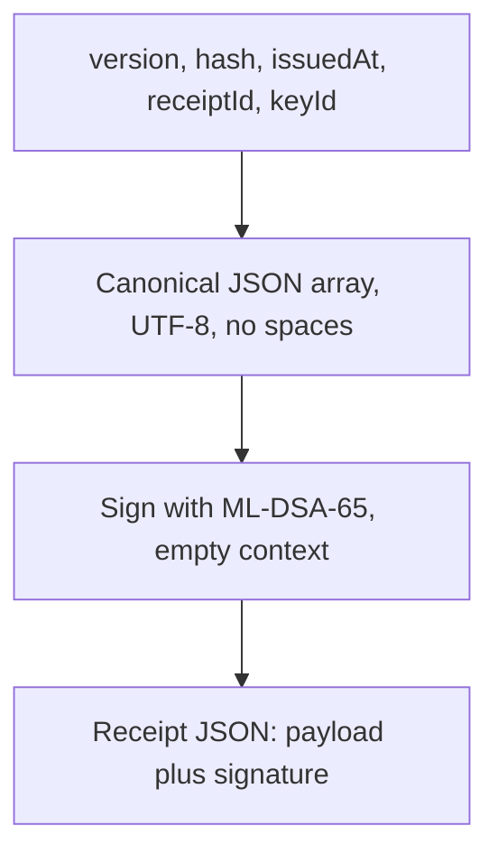

V2 exclusively uses ML-DSA-65 (FIPS 204). All older Ed25519 keys must be discarded. V1 receipts are rejected, including mathematically valid signatures. API routes are /api/v2/stamp, /api/v2/verify, and /api/v2/keys; v1 routes return 404.

## Receipt structure

Receipt JSON contains exactly payload and signature. Payload contains exactly version, hash, issuedAt, receiptId, and keyId:

- version: integer 2. This version fixes the signature algorithm to ML-DSA-65; no algorithm negotiation or fallback is allowed.
- hash: exactly 64 lowercase hexadecimal characters, SHA-256 of original file bytes.
- issuedAt: valid UTC calendar timestamp YYYY-MM-DDTHH:mm:ss.sssZ.
- receiptId: canonical unpadded Base64url of 16 random bytes (22 characters).
- keyId: 1–128 ASCII letters, digits, periods, underscores or hyphens; selects an authentic ML-DSA-65 public key.
- signature: canonical unpadded Base64url of a raw 3309-byte ML-DSA-65 signature (4412 characters).

Reject extra fields, unsupported versions, noncanonical Base64url, invalid dates, and incorrect lengths. Receipt JSON is limited to 8192 UTF-8 bytes. The verification request body is also bounded to 8192 bytes; Base64 wrapping consumes part of that budget.

## Exact signed bytes

The signature covers the payload fields assembled as one canonical array:



Encode this compact JSON array as UTF-8, without BOM, spaces, or trailing newline:

```js
JSON.stringify([
  'Momento timestamp receipt v2 / ML-DSA-65',
  payload.version,
  payload.hash,
  payload.issuedAt,
  payload.receiptId,
  payload.keyId,
]);
```

Use pure ML-DSA-65, with an empty FIPS 204 context. Do not use HashML-DSA or the internal external-mu API. Production signing uses fresh hedged randomness from the system CSPRNG. Public keys are raw 1952-byte values and private keys are expanded raw 4032-byte values, encoded as canonical unpadded Base64url. Never include private keys in receipts.

## Verification and trust

Strictly parse first. Select the public key via an own-property lookup. Reject unknown, malformed or compromised keys. Verify ML-DSA-65 over the exact bytes above, then compare a fresh file hash when checking file association. Authentic public-key distribution remains required; discovery metadata is not self-authenticating.

The algorithm is designed to resist known quantum attacks, not guaranteed unbreakable. SHA-256 fingerprint security is distinct from ML-DSA signature security. The signing key and clock remain trusted; an issuer can deliberately backdate. The pinned JavaScript implementation is not independently audited and makes no constant-time claim.

## Fixed interoperability vector

See [downloadable interoperability vector](/test-vectors/protocol-v2.json) for exact message bytes, public key, signature and a public deterministic test seed. Never use that seed for real issuance. Tests check the fixture against Node/OpenSSL independently of the JavaScript signer, altered fields and signatures, v1 rejection, malformed encodings, key lifecycle and browser-compatible receipt encoding.

## Migration

Discard all older Ed25519 signing and verification keys, including saved offline copies. Update API clients, CLI, Action and web verifiers to v2. Re-timestamp original files to get fresh receipts; reissuance records the current time and cannot retroactively restore the old proof. See [key lifecycle](/docs/key-lifecycle).

## Public keys and offline verification

Obtain public keys from [`/api/v2/keys`](/api/v2/keys), then retain an authentic copy for offline use. Discovery data must be obtained through a trusted channel. The [API guide](/docs/api#verify-offline) includes runnable verification examples. See [key lifecycle](/docs/key-lifecycle) for fingerprint metadata, rotation and compromise policy, and [trust and time accuracy](/docs/trust) for receipt limits.
