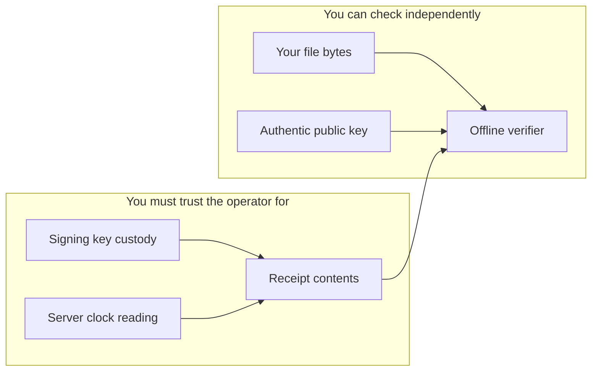

## Protected properties

- Original files stay on the client. Stamping sends a SHA-256 digest.
- ML-DSA-65 authenticates the domain-separated v2 payload, including hash, issuance time, random ID, and key ID.
- Verification validates structure and canonical encodings before checking signatures; comparing a fresh file hash associates the receipt with those bytes.
- API body bounds, client and location rate limits, bounded client receipt reads, and timeouts limit accidental and abusive resource use.
- The signer fails closed on missing/mismatched keys and rate-limit errors. Request logs omit request bodies, hashes, client IPs, queries, and arbitrary user-controlled paths.

## Trust boundaries

The issuer's signing key and clock are trusted. HTTPS and an authentic verifier/public key are required. A substituted verifier or a compromised website can mislead its user. Anyone holding a shared receipt link can read its hash and time; a hash can reveal a known low-entropy document through guessing. Hashing is not encryption.

Receipts authenticate hashes of raw Git commit objects, including their metadata; author/committer dates are still self-reported values, not certified creation times. Local receipt links bound the exact linked commit’s formation between its parents’ receipt issuance and its own issuance, under honest signing and cryptographic assumptions. An activation commit has only an upper bound. Hooks can be bypassed, but missing or invalid links fail independent history verification. Stateless issuance cannot detect hidden alternative histories or establish when code was written. Repository owners can change workflows and activation policy. Badge branches and images are mutable/cached displays; preserve the source history, `momento-proofs` and authentic verifier independently. See [Git integration](/docs/git).

## Cryptographic migration

ML-DSA-65 is a NIST-standardized post-quantum signature algorithm. All older Ed25519 keys are discarded and all v1 receipts rejected. SHA-256 file fingerprints remain unchanged; quantum attacks reduce their security margins independently of signature security. The pinned JavaScript library is not independently audited and does not claim constant-time execution. This is quantum-resistant receipt signing, not an absolute security guarantee.

## Limits

The issuer or a stolen-key holder can create a new backdated receipt. No independent clock-error bound, transparency log, external anchor, uptime SLA, or RFC 3161 compatibility is provided. Rate limits are approximate and local to a Cloudflare location, not a billing counter or global request budget. A distributed attacker can still affect availability.

The status page is an on-demand readiness check, not independently monitored uptime history. Key compromise notices require verifier updates; offline clients do not receive revocation updates automatically.

## Future transparency anchoring

The intended future design is a disclosed, append-only receipt commitment log, deterministic Merkle leaves and inclusion proofs, periodic batch roots, and independent timestamps over those roots. This needs durable storage, retention/privacy choices, recovery procedures, and verification of the external authority. It should ship as a separate, explicitly tested feature. V2 does not claim its protection.
