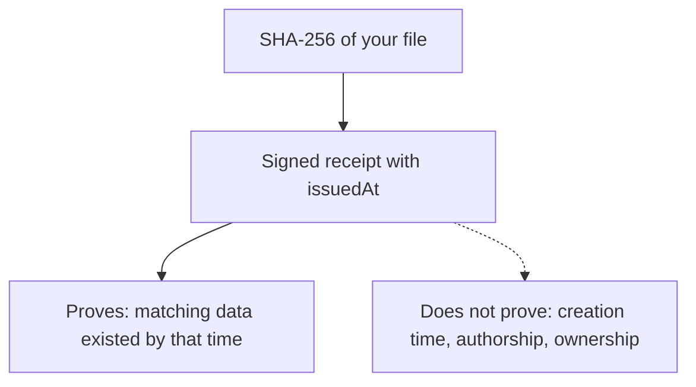

Momento is a timestamp authority using a custom signed JSON protocol. Its receipts can be checked independently with the [public key and verifier](/docs/api#verify-offline). It does **not** implement the [RFC 3161 timestamp protocol](https://www.rfc-editor.org/rfc/rfc3161.html). A timestamp provides evidence of existence by a time; it does not establish the original creation time, authorship, or ownership of a file.

## What you can verify



| Property | What Momento provides |
| --- | --- |
| Receipt integrity | ML-DSA-65 verification checks the signed hash, timestamp, receipt ID, version, and key ID. Editing a signed field invalidates the existing signature. |
| File association | Recomputing SHA-256 over the file's raw bytes lets you check that it matches the signed hash. |
| Client control of time | The stamp endpoint accepts only a hash. The Worker selects `issuedAt` from its own clock. |
| Offline verification | Saved receipts can be verified without calling Momento. Obtain and retain the authentic public key through a trusted channel. |
| UTC accuracy | The service reads the Worker clock. No measured or independently certified clock-error bound is currently published. |
| Protection against issuer backdating | The current protocol has no independent witness or external timestamp anchor that prevents the signing-key holder from issuing a receipt with an earlier date. |

## Cryptographic strength

Momento v2 uses **ML-DSA-65**, a NIST category 3 post-quantum signature algorithm standardized in [FIPS 204](https://csrc.nist.gov/pubs/fips/204/final). It is designed to resist known classical and quantum attacks; “quantum-proof” is not an absolute guarantee.

File fingerprints remain SHA-256. Hash security and signature security are distinct; quantum algorithms reduce the margins of SHA-256, and this upgrade does not claim category 3 security for the entire system. Key protection, implementation correctness, and the issuer’s clock still matter. The pinned JavaScript cryptography library is not independently audited and does not claim constant-time signing.

<Callout title="Signatures and backdating" type="warn">

**There is no supported “99% impossible to backdate” claim.** An outsider without the private key would need to defeat the signature protection to change the signed time. Someone who controls the private key can instead sign a new receipt containing an earlier time; that requires no cryptographic break. Open source makes the implementation inspectable, but does not prove which code an operator deployed.

</Callout>

## What a time-error bound would mean

Let $t_s$ be the signed `issuedAt`, $t_r$ the actual UTC instant when the server sampled its clock, and $\Delta$ a validated upper bound on absolute clock error. If that bound were established, then:

```math
|t_s - t_r| \leq \Delta \quad \Longrightarrow \quad t_r \in [t_s - \Delta, t_s + \Delta]
```

Under honest issuance and the cryptographic assumptions above, matching data would therefore have existed no later than $t_s + \Delta$. This interval concerns the server's clock reading, not file creation, network transit, or when a badge becomes visible.

**Current status: Momento does not establish a numerical value for $\Delta$.** Millisecond formatting in `issuedAt` is representation precision, not a guarantee of millisecond accuracy. A 99% coverage claim would require a defined measurement method and evidence that the proposed interval covers the actual time at that rate; signature strength supplies neither.

## Check and preserve a receipt

1. Keep the original file bytes, receipt, and authentic public verification key. For the Action’s `stamp` mode, retain `commit.txt`, `receipt.json`, and `proof.json`. For `verify-history`, preserve the source Git objects, the complete `momento-proofs` branch, the reported activation SHA (if any), and `proof.json`; verify the chain independently using the [Git integration](/docs/git). Receipt links establish formation bounds for the exact commit object, not when its code was written or the truth of its Git dates.
2. Verify the signature locally and compare the file's SHA-256 with the signed hash. The CLI command is shown below; the Action also performs these checks before publishing.
3. For a commit receipt, compare `commit.txt` against `git cat-file commit COMMIT` from the original repository. Git author and committer dates are separate metadata.
4. If your use case needs evidence independent of Momento's operator, obtain an additional independent timestamp over the receipt or preserve it in an independently witnessed publication system. That can establish that the receipt existed by the external observation time; it does not retroactively certify Momento's clock reading.

```sh
bun run --cwd packages/cli start -- verify path/to/receipt.json path/to/file
```

The badge is a convenient display. Its color, cached image, and mutable publishing branch are not substitutes for receipt verification or independent preservation.

## Key rotation and future anchoring

This release discards all older Ed25519 keys and rejects v1 receipts. Re-timestamp original files to get v2 receipts; their timestamps will be the new issuance times. Future routine ML-DSA-65 rotation can preserve uncompromised v2 public keys. A compromised key is different: an updated verifier refuses receipts under it, and an old offline verifier needs an authentic update to learn that status. See [Protocol v2](/docs/protocol) and the [key lifecycle procedure](/docs/key-lifecycle).

A public transparency log with independently timestamped batch roots is future work. It is not part of v2, and current receipts do not claim that protection.

